# Testing the labMT Hedonometer on Online Toxicity: From Lexicon Structure to Civil Comments

**Student:** Alessia Jia  
**Course:** Coding Humanities  
**Assignment:** Individual Repair Project  
**Corpus:** Jigsaw / Civil Comments toxicity dataset


---

# Project Overview

This repository is my individual repair submission and is separate from the first group repository.

 This project tests how the labMT hedonometer works as a method for analysing emotional language at scale. The project has two connected parts.

In **Part 1**, I treat the labMT 1.0 lexicon itself as an object of study. I clean the dataset, inspect its structure, check missing values, and visualise how happiness scores are distributed across words.

In **Part 2**, I use the cleaned labMT lexicon as a measurement tool and apply it to a new corpus: the **Jigsaw / Civil Comments toxicity dataset**. This corpus contains online comments and a meaningful metadata variable: a toxicity score between 0 and 1. I use this metadata to compare low-toxicity and high-toxicity comments.

The main research question is:

**To what extent can the labMT hedonometer distinguish between low-toxicity and high-toxicity online comments, and what does this reveal about the limits of using emotional valence as a proxy for toxic language?**

This question is important because automated sentiment analysis is often used to summarise large-scale online discussion. However, toxic language is not exactly the same as negative emotional language. A comment can be toxic because it attacks, insults, threatens, or targets someone, not only because it contains negative words. This project therefore asks whether a word-level happiness lexicon can capture some pattern in toxic comments, while also showing where this method becomes limited.

The main finding is that **low-toxicity comments have higher labMT happiness scores than high-toxicity comments**, with an observed difference of about **0.218** on the 1–9 labMT happiness scale. The result is stable in both bootstrap resampling and small-sample checks. However, the result should still be interpreted carefully. labMT can detect a broad emotional tendency, but it should not be treated as a precise toxicity classifier.

---

# Difference from the First Group Attempt

The first group attempt used the **IMDb Large Movie Review Dataset** as the applied corpus. For this individual repair project, I changed the corpus completely.

This project uses the **Jigsaw / Civil Comments toxicity dataset**, which is a different source, a different genre, and a different social context. Instead of movie reviews and rating/sentiment labels, this corpus contains online public comments with toxicity annotations.

This change is important because the repair assignment requires a genuinely different corpus or API source, not only a smaller slice or different grouping of the same dataset. The new corpus still contains text, includes meaningful metadata for comparison, and can be accessed legally and ethically through the Hugging Face `datasets` library.

---

# Repository Structure

```text
coding-humanities-resit-final/
├── README.md
├── requirements.txt
├── .gitignore
├── data/
│   ├── raw/
│   │   └── Data_Set_S1.txt
│   ├── clean/
│   │   └── labMT_clean.csv
│   └── processed/
│       ├── civil_comments_sample.csv
│       └── civil_comments_scored.csv
├── figures/
│   ├── mini1_fig1_happiness_distribution.png
│   ├── mini1_fig2_top_10_positive_words.png
│   ├── mini1_fig3_top_10_negative_words.png
│   ├── mini1_fig4_rank_coverage_missingness.png
│   ├── mini1_fig5_happiness_vs_disagreement.png
│   ├── mini1_workflow_diagram.png
│   ├── mini2_fig7_civil_comments_workflow.png
│   ├── mini2_fig8_happiness_distribution_by_toxicity.png
│   ├── mini2_fig9_boxplot_by_toxicity.png
│   ├── mini2_fig10_bootstrap_mean_difference.png
│   ├── mini2_fig11_small_sample_stability.png
│   ├── mini2_fig12_matched_token_count_by_toxicity.png
│   ├── mini2_fig13_toxicity_vs_happiness.png
│   └── mini2_fig14_coverage_ratio_by_toxicity.png
├── src/
│   ├── mini1_load_clean_labmt.py
│   ├── mini1_sanity_checks.py
│   ├── mini1_visualisations.py
│   ├── mini1_workflow_figure.py
│   ├── mini2_fetch_civil_comments.py
│   ├── mini2_score_comments.py
│   └── mini2_analysis_figures.py
└── tables/
    ├── mini1_data_dictionary.csv
    ├── mini1_missing_values.csv
    ├── mini1_random_sample_15_rows.csv
    ├── mini1_summary_statistics.csv
    ├── mini1_top_10_positive_words.csv
    ├── mini1_top_10_negative_words.csv
    ├── mini2_table2_toxicity_summary.csv
    ├── mini2_table3_bootstrap_summary.csv
    ├── mini2_table4_small_sample_stability.csv
    ├── mini2_table5_mismatch_examples.csv
    └── mini2_mismatch_examples_readable.txt
```

---

# Part 1: Understanding the labMT Lexicon

Part 1 focuses on the labMT 1.0 lexicon. Before using labMT to analyse another corpus, I first examine what kind of measurement tool it is.

The labMT dataset contains words and their average happiness ratings. Each word has a `happiness_average` score on a 1–9 scale, where lower values indicate more negative words and higher values indicate more positive words.

The main purpose of Part 1 is to understand the structure of the lexicon before treating it as a measurement instrument in Part 2.

---

## 1.1 Loading and Cleaning the labMT Dataset

The raw labMT file was stored at:

```text
data/raw/Data_Set_S1.txt
```

The script used for loading and cleaning was:

```text
src/mini1_load_clean_labmt.py
```

The cleaned version was saved as:

```text
data/clean/labMT_clean.csv
```

The raw file includes metadata and comment lines before the actual data table, so the script removes those non-data lines and loads the remaining tabular content into a pandas DataFrame.

During cleaning, I also converted numerical columns into numeric types. Some corpus rank columns contained missing values. These missing values are meaningful because not every labMT word appears in every corpus ranking source.

The cleaned dataset contains **10,222 rows and 8 columns**.

---

## 1.2 Data Dictionary and Sanity Checks

To make the structure of the dataset more transparent, I generated a data dictionary and several sanity check tables.

The generated tables include:

```text
tables/mini1_data_dictionary.csv
tables/mini1_missing_values.csv
tables/mini1_random_sample_15_rows.csv
tables/mini1_summary_statistics.csv
```

The main columns are:

| Column | Meaning |
|---|---|
| `word` | The word being scored |
| `happiness_rank` | Rank order based on happiness |
| `happiness_average` | Average happiness score from human ratings |
| `happiness_standard_deviation` | Disagreement or variation in human ratings |
| `twitter_rank` | Rank of the word in the Twitter corpus |
| `google_rank` | Rank of the word in the Google corpus |
| `nyt_rank` | Rank of the word in the New York Times corpus |
| `lyrics_rank` | Rank of the word in the lyrics corpus |

The missing values mainly appear in the corpus rank columns. This means that some words are included in labMT but do not appear in every corpus-specific ranking. I did not treat these values as mistakes, because they show limits of corpus coverage rather than simple data errors.

---

## 1.3 Cleaning Workflow

The cleaning process was saved as a workflow diagram.

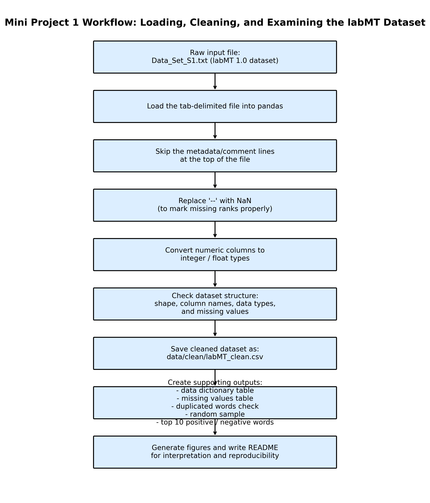

**Figure 1. Data cleaning workflow for the labMT lexicon.**

The workflow shows how the raw labMT file was transformed into a clean CSV file and then used to generate tables and figures. This is important because the repair project should be reproducible: the marker should be able to trace a result from raw input, to script, to output.

---

## 1.4 Distribution of Happiness Scores

The first main visualisation shows the distribution of happiness scores in the labMT lexicon.

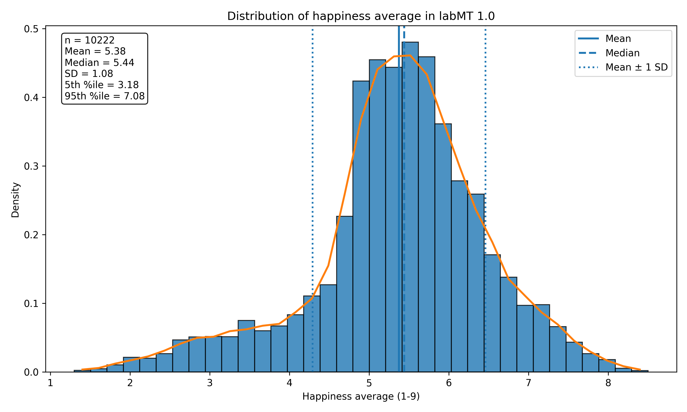

**Figure 2. Distribution of happiness average scores in labMT.**

The distribution shows that many words are clustered around the middle of the 1–9 scale. This is important because labMT is not only a list of clearly positive and clearly negative words. A large number of words have moderate scores.

This matters for Part 2 because most real comments are not made only of extreme emotional words. When labMT is applied to a comment, the comment-level score is often pulled toward the middle because it averages many matched words.

---

## 1.5 Most Positive and Most Negative Words

The next two figures show the most positive and most negative words in the lexicon.

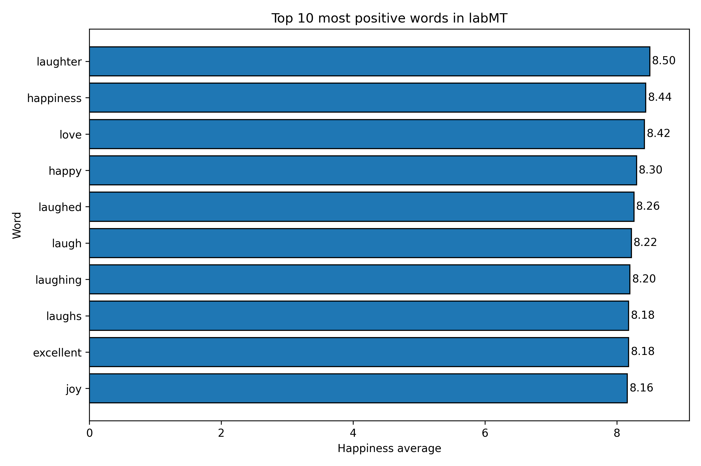

**Figure 3. Top 10 most positive words in labMT.**

The most positive words include terms such as laughter, happiness, love, happy, and joy. These are clearly positive emotional words, so they fit the basic expectation of a happiness lexicon.

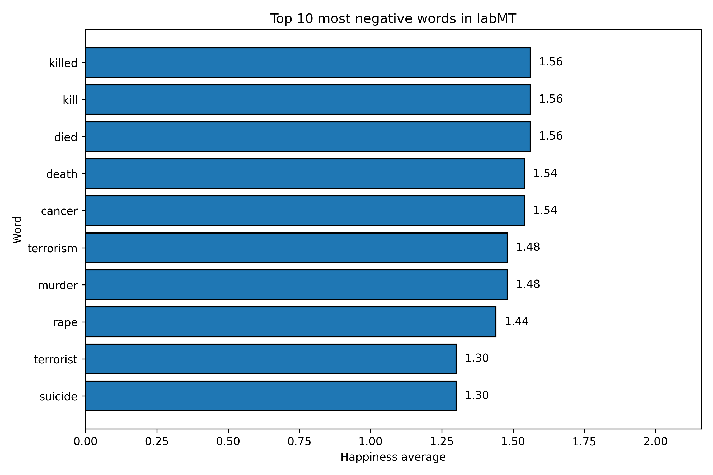

**Figure 4. Top 10 most negative words in labMT.**

The most negative words include terms related to death, violence, illness, terrorism, rape, and suicide. These words are clearly negative in emotional valence.

These two figures are useful because they show that the extremes of labMT are easy to interpret. However, real online comments may use words in more complex ways. For example, a comment might mention violence in a news context without being personally toxic, or use positive words sarcastically.

---

## 1.6 Corpus Coverage and Missingness

I also examined the corpus rank columns to see how often labMT words have ranks across different corpus sources.

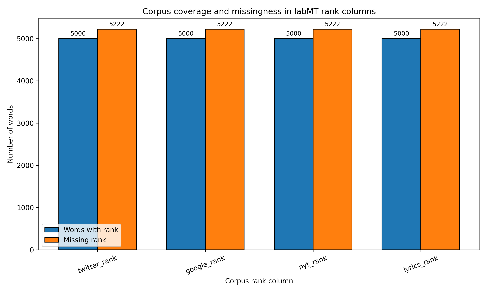

**Figure 5. Corpus coverage and missingness in labMT rank columns.**

This figure shows that the corpus rank columns have many missing values. This does not necessarily mean the data is wrong. Instead, it shows that corpus coverage is uneven. Some words are present in labMT but do not appear in every corpus rank source.

This matters because labMT is built from word-level ratings, but its relationship to real corpora depends on which words actually appear in a corpus. In Part 2, I therefore also calculate matched token counts and coverage ratios when applying labMT to Civil Comments.

---

## 1.7 Happiness Score and Rating Disagreement

The final Part 1 figure compares average happiness with rating disagreement.

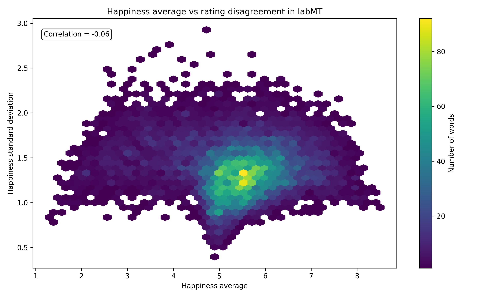

**Figure 6. Happiness average versus rating disagreement in labMT.**

This figure compares the average happiness score of a word with its standard deviation. A higher standard deviation means that human raters disagreed more about the emotional value of the word.

This is important because labMT is based on human ratings. It is transparent, but it is not neutral or perfect. Some words may be interpreted differently depending on context, culture, or usage. This limitation becomes especially important when the lexicon is used to analyse online comments.

---

## 1.8 Part 1 Conclusion

Part 1 shows that labMT is a useful but limited measurement tool. It gives a clear numerical happiness score to each word, which makes it easy to apply computationally. However, it also scores words in isolation.

This means labMT can show broad emotional tendencies, but it cannot fully understand context, sarcasm, negation, target, or social meaning. This limitation is important for Part 2, where I apply labMT to online comments about toxicity.

---

# Part 2: Applying labMT to Civil Comments

Part 2 applies the cleaned labMT lexicon from Part 1 to the Civil Comments toxicity dataset.

The research question for this part is:

**To what extent can the labMT hedonometer distinguish between low-toxicity and high-toxicity online comments, and what does this reveal about the limits of using emotional valence as a proxy for toxic language?**

This question is useful because toxicity is a major issue in online platforms and comment moderation. However, toxicity is not the same thing as negative emotion. A toxic comment may include insults, harassment, identity attacks, threats, or aggressive language. A non-toxic comment may still discuss negative topics. By comparing toxicity labels with labMT happiness scores, I can examine whether emotional valence captures part of toxicity, and where it fails.

---

## 2.1 Corpus and Provenance

The corpus used in Part 2 is the **Civil Comments toxicity dataset**, accessed through the Hugging Face `datasets` library.

The original dataset contains online comments and toxicity-related annotations. For this project, I used the `text` column as the comment corpus and the `toxicity` score as the metadata variable for comparison.

The toxicity score is a value between 0 and 1. Higher values indicate that a comment is more likely to be considered toxic by annotators.

For this project, I created two balanced groups:

| Group | Threshold | Number of comments |
|---|---:|---:|
| Low toxicity | `toxicity <= 0.10` | 5,000 |
| High toxicity | `toxicity >= 0.80` | 5,000 |

The processed sample was saved as:

```text
data/processed/civil_comments_sample.csv
```

This sampling strategy was chosen because it creates a clear comparison between comments that are very unlikely to be toxic and comments that are very likely to be toxic. It also avoids using an unnecessarily huge dataset, which would make even very small effects appear statistically stable.

---

## 2.2 Ethical and Practical Considerations

The Civil Comments dataset contains public online comments, but it still needs to be handled carefully. This project does not try to infer private attributes about individuals. I only use the comment text and the provided toxicity score.

I also do not treat toxicity labels as absolute truth. The labels come from annotation processes, and annotation itself may reflect cultural assumptions, platform norms, and possible bias. Therefore, I use the toxicity score as a practical metadata variable for comparison, not as a perfect definition of harm.

Another limitation is that this project uses only a sampled subset of the dataset. The sample is useful for a focused comparison, but it does not represent every type of online toxicity.

---

## 2.3 Civil Comments Data Preparation

The Civil Comments sample was created using:

```text
src/mini2_fetch_civil_comments.py
```

This script downloads the dataset through the Hugging Face `datasets` library, scans the training split, and selects two balanced groups:

```text
5,000 low-toxicity comments
5,000 high-toxicity comments
```

The resulting sample has:

```text
10,000 comments and 5 columns
```

The high-toxicity group has an average toxicity score of about **0.869**, while the low-toxicity group has an average toxicity score close to **0.000**. This means the two groups are clearly separated by the metadata variable.

The word count also differs between groups. Low-toxicity comments have a higher average word count than high-toxicity comments. This matters because longer comments can naturally contain more matched labMT words.

---

## 2.4 Scoring Method: Operationalising the Hedonometer

The comments were scored using:

```text
src/mini2_score_comments.py
```

The scoring method follows these steps:

1. Convert each comment into lowercase text.
2. Tokenise the text into alphabetic word tokens.
3. Match each token to the cleaned labMT lexicon.
4. Extract the labMT `happiness_average` score for each matched token.
5. Compute a comment-level `mean_happiness` score.
6. Record `matched_token_count` and `coverage_ratio`.

The main output was saved as:

```text
data/processed/civil_comments_scored.csv
```

The key columns added were:

| Column | Meaning |
|---|---|
| `token_count` | Number of alphabetic tokens in the comment |
| `matched_token_count` | Number of tokens found in the labMT lexicon |
| `coverage_ratio` | Matched tokens divided by total tokens |
| `mean_happiness` | Average labMT happiness score of matched tokens |

This operationalisation treats each comment as one document. The happiness score is therefore the average happiness of all labMT-matched words in that comment.

---

## 2.5 Civil Comments Scoring Workflow

The full Part 2 workflow is shown below.

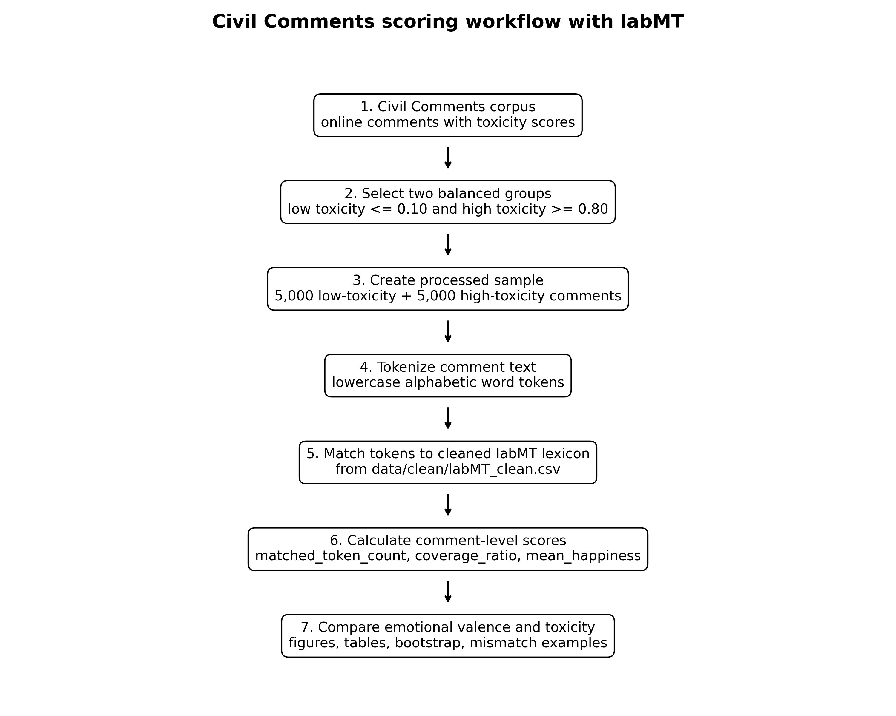

**Figure 7. Civil Comments scoring workflow with labMT.**

The workflow connects the new corpus to the cleaned labMT lexicon from Part 1. It shows how the project moves from raw online comments, to a balanced toxicity sample, to tokenisation, labMT matching, scoring, and final interpretation.

This figure is important because it makes the code path inspectable. The result in the README is not a screenshot or manual calculation; it is generated through scripts in the `src/` folder.

---

## 2.6 Main Result: Low-Toxicity vs High-Toxicity Comments

The main comparison looks at whether low-toxicity comments receive higher labMT happiness scores than high-toxicity comments.

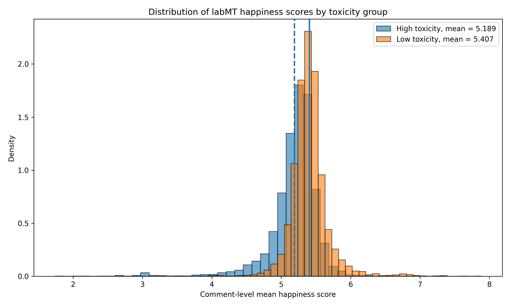

**Figure 8. Distribution of labMT happiness scores by toxicity group.**

The result shows a clear difference between the two groups:

| Toxicity group | Number of comments | Mean happiness | Interpretation |
|---|---:|---:|---|
| High toxicity | 5,000 | 5.189 | Lower average emotional valence |
| Low toxicity | 5,000 | 5.407 | Higher average emotional valence |

The observed mean difference is:

```text
low toxicity - high toxicity = 0.218
```

This suggests that labMT can detect a broad emotional difference between low-toxicity and high-toxicity comments. High-toxicity comments tend to contain more negative emotional language, while low-toxicity comments tend to have higher happiness scores.

However, this does not mean that labMT can fully detect toxicity. The difference is visible at the group level, but toxicity is more complex than word-level happiness.

---

## 2.7 Boxplot Comparison

To make the comparison clearer, I also used a boxplot.

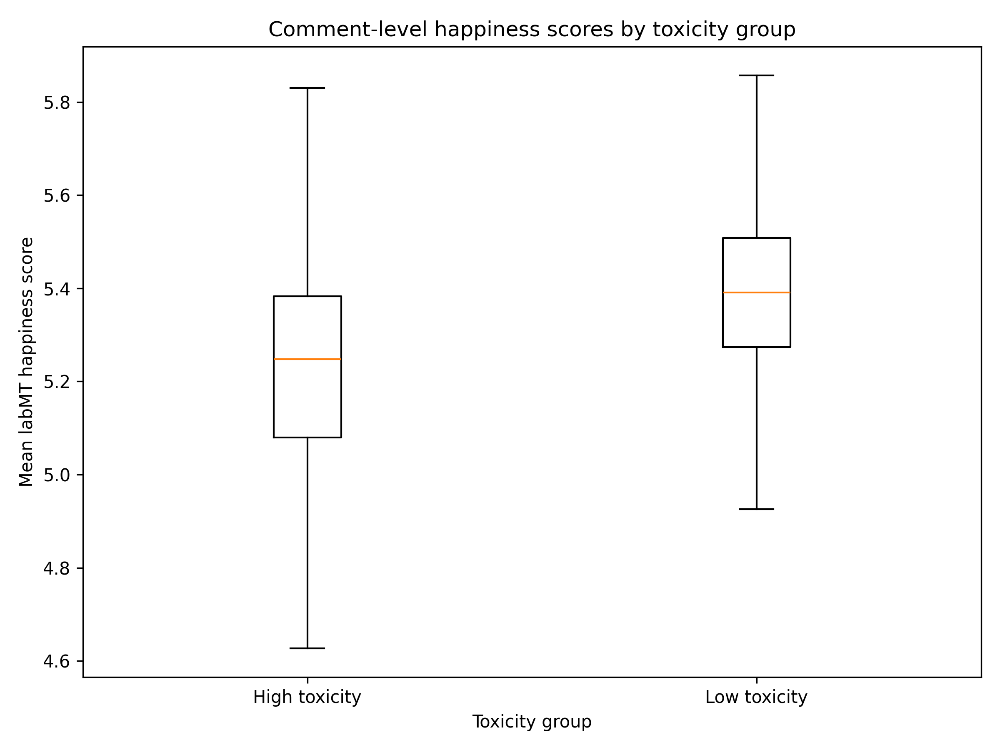

**Figure 9. Comment-level happiness scores by toxicity group.**

The boxplot shows that the low-toxicity group is shifted upward compared with the high-toxicity group. This supports the main distribution figure.

At the same time, the groups still overlap. This overlap is important. It means that some high-toxicity comments still have moderate or high happiness scores, and some low-toxicity comments have low happiness scores. Therefore, labMT should be interpreted as a broad hedonometer, not as a direct toxicity detector.

---

## 2.8 Bootstrap Analysis and Uncertainty

To check whether the mean difference is stable, I used bootstrap resampling. The bootstrap repeatedly resamples low-toxicity and high-toxicity comments and recalculates the mean difference.

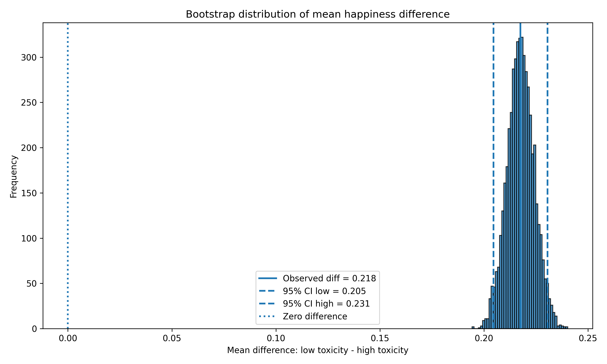

**Figure 10. Bootstrap distribution of the mean happiness difference.**

The observed difference is:

```text
0.217578
```

The 95% bootstrap confidence interval is:

```text
[0.204608, 0.230614]
```

Because the confidence interval is entirely above zero, the difference is stable in this sample. This supports the claim that low-toxicity comments have higher average labMT happiness scores than high-toxicity comments.

However, this should not be overclaimed. The bootstrap shows that the group-level mean difference is stable, but it does not prove that labMT can identify toxicity in individual comments.

---

## 2.9 Small-Sample Stability Check

To avoid relying only on the full 10,000-comment sample, I also ran a small-sample stability check. In each repetition, I sampled:

```text
500 low-toxicity comments
500 high-toxicity comments
```

I repeated this process **500 times** and recalculated the mean difference each time.

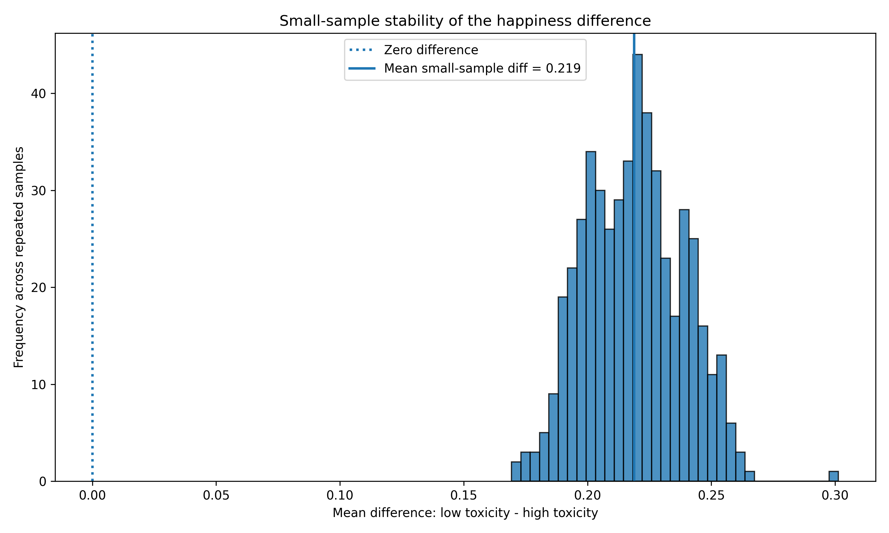

**Figure 11. Small-sample stability of the happiness difference.**

The small-sample mean difference was:

```text
0.218839
```

The proportion of samples with a positive difference was:

```text
1.000
```

This means that in every repeated small sample, low-toxicity comments still had higher average happiness scores than high-toxicity comments.

| Check | Result |
|---|---:|
| Sample size per group | 500 |
| Number of repeats | 500 |
| Mean small-sample difference | 0.219 |
| Proportion of positive differences | 1.000 |

This strengthens the finding because the result is not only visible in the full sample. The direction of the difference remains stable even when using smaller balanced samples.

---

## 2.10 Matched Token Count and Coverage

I also checked how many words in each comment were matched to labMT.

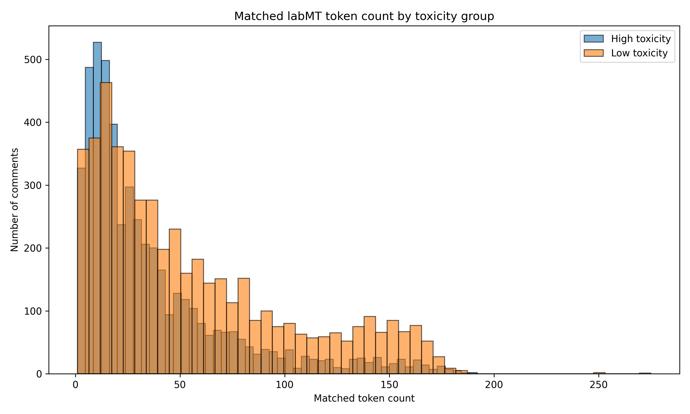

**Figure 12. Matched labMT token count by toxicity group.**

The matched token count differs between groups:

| Toxicity group | Mean matched token count |
|---|---:|
| High toxicity | 36.650 |
| Low toxicity | 55.445 |

Low-toxicity comments have more matched tokens on average. This is partly because they are longer on average. This matters because a comment with more matched tokens gives a more stable average happiness score.

I also calculated coverage ratio, which measures the proportion of tokens that were matched to labMT.

| Toxicity group | Mean coverage ratio |
|---|---:|
| High toxicity | 0.903 |
| Low toxicity | 0.915 |

Both groups have high coverage ratios, which means most alphabetic tokens in the comments could be matched to labMT. This makes the scoring method reasonably reliable for this corpus. However, coverage is not perfect, and words outside the lexicon are not included in the score.

---

## 2.11 Toxicity Score and Happiness Score

Instead of only comparing the two threshold-based groups, I also examined the relationship between the continuous toxicity score and labMT happiness.

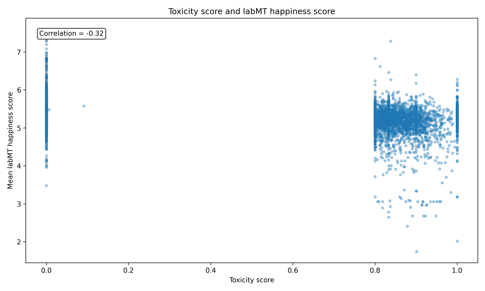

**Figure 13. Toxicity score and labMT happiness score.**

The correlation between toxicity and happiness is:

```text
-0.317
```

This negative correlation means that comments with higher toxicity scores tend to have lower labMT happiness scores. This supports the main result.

However, the correlation is moderate rather than perfect. This is important because it shows that toxicity and emotional negativity are related, but not identical. Toxicity cannot be reduced to a single happiness score.

---

## 2.12 Coverage Ratio by Toxicity Group

The final Part 2 figure compares labMT coverage ratios across the two toxicity groups.

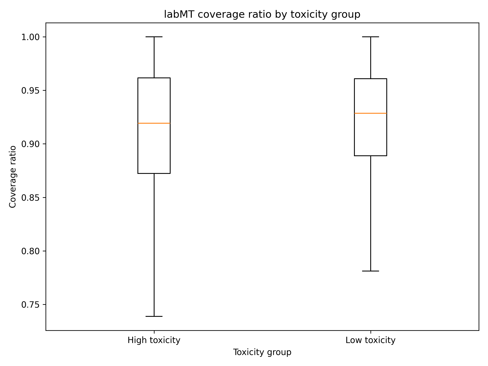

**Figure 14. labMT coverage ratio by toxicity group.**

The coverage ratio is high in both groups. This suggests that the lexicon can match most tokens in this sample. However, coverage does not solve the main interpretive problem. Even if most words are matched, labMT still scores words individually and does not understand context, target, sarcasm, or whether a negative word is being used to attack someone.

Therefore, good coverage makes the measurement more technically reliable, but it does not make the method socially or semantically complete.

---

## 2.13 Mismatch Examples and Method Limits

To better understand the limits of labMT, I also selected mismatch examples. These were saved in:

```text
tables/mini2_table5_mismatch_examples.csv
tables/mini2_mismatch_examples_readable.txt
```

The mismatch examples include:

| Mismatch type | What it means | Why it matters |
|---|---|---|
| High toxicity with high labMT happiness | A comment is labelled highly toxic but receives a relatively high happiness score | Toxicity may come from insult, target, or social meaning, not only negative emotional words |
| Low toxicity with low labMT happiness | A comment is labelled low toxicity but receives a low happiness score | A comment may discuss negative topics without being toxic |
| High coverage but misleading score | Most words are matched, but the score still misses context | Lexical coverage does not equal semantic understanding |

These examples show why labMT should not be used as a toxicity classifier. It can capture emotional valence, but toxicity depends on social context and communicative intent.

---

## 2.14 Part 2 Conclusion

Part 2 shows that labMT can detect a clear group-level difference between low-toxicity and high-toxicity online comments. Low-toxicity comments have a higher average happiness score than high-toxicity comments, and this result is stable across both bootstrap resampling and small-sample checks.

The main result is:

```text
low-toxicity mean happiness = 5.407
high-toxicity mean happiness = 5.189
difference = 0.218
```

This means that high-toxicity comments are, on average, emotionally more negative according to labMT.

However, the stronger interpretation is not that labMT “detects toxicity.” Instead, the project shows that emotional valence and toxicity are related but not the same. labMT can reveal a broad emotional pattern, but it cannot understand whether a comment is harmful, targeted, sarcastic, or context-dependent.

Therefore, the main finding is:

**labMT is useful for detecting aggregate emotional tendencies in online comments, but it is not sufficient as a standalone method for analysing toxicity.**

---

# Overall Critical Reflection

This project shows that labMT can be useful for measuring emotional language at scale, but it also shows why lexicon-based sentiment analysis needs to be interpreted carefully.

The wider significance of this project is connected to online platforms. Online comments are now one of the main places where people express opinions, disagreement, anger, support, and harm. Because there are too many comments to read one by one, computational methods are often used to summarise or moderate large-scale discussion. This can be useful, but it can also be risky. A method like labMT can show general emotional patterns, but it also reduces complex comments into a single numerical score.

In Part 1, I examined labMT before applying it to another corpus. This was important because labMT is not a neutral black-box tool. It is a word-level happiness lexicon based on human ratings, and each word is assigned a fixed average score. This makes the method transparent and reproducible, but it also creates limitations. Words are scored in isolation, so labMT cannot fully capture context, irony, negation, sarcasm, or changes in meaning across different situations.

In Part 2, the Civil Comments analysis showed that low-toxicity comments have higher average labMT happiness scores than high-toxicity comments. This result was stable in the full sample, the bootstrap analysis, and the small-sample stability check. However, the finding should still be interpreted as a group-level pattern, not as an individual-level classification tool.

One important limitation is the toxicity metadata itself. The toxicity score is useful for comparison, but it is not a perfect measurement of harm. Annotation processes can reflect cultural assumptions, platform norms, and disagreement between annotators. A comment can also be harmful in ways that depend on context, identity, target, or conversation history.

Another limitation is that labMT measures emotional valence, not toxicity. A highly toxic comment might contain positive words used sarcastically or aggressively. A low-toxicity comment might contain negative words because it discusses painful events, illness, violence, or social problems. In these cases, labMT may correctly score the emotional tone of the words, but still miss the social meaning of the comment.

Overall, this project suggests that labMT works best as a broad hedonometer rather than a precise classifier. It can reveal general emotional tendencies across many texts, but it cannot replace close reading or contextual interpretation. The most important finding is not simply that toxic comments are “less happy.” More importantly, the project shows both the usefulness and the limits of applying a transparent computational method to socially sensitive online language.

---

# How to Run the Code

This project can be reproduced by running the Python scripts in the `src/` folder. The scripts should be run from the root folder of the repository.

Install the required packages:

```bash
pip install -r requirements.txt
```

The raw labMT file should be placed at:

```text
data/raw/Data_Set_S1.txt
```

The Civil Comments corpus is fetched using the Hugging Face `datasets` library through this script:

```text
src/mini2_fetch_civil_comments.py
```

To reproduce the full project, run the scripts in this order:

```bash
python src/mini1_load_clean_labmt.py
python src/mini1_sanity_checks.py
python src/mini1_visualisations.py
python src/mini1_workflow_figure.py
python src/mini2_fetch_civil_comments.py
python src/mini2_score_comments.py
python src/mini2_analysis_figures.py
```

The first four scripts reproduce Part 1. They clean the labMT dataset, generate sanity check tables, and create the Part 1 figures.

The last three scripts reproduce Part 2. They fetch and sample the Civil Comments corpus, calculate labMT happiness scores for each comment, and generate the Part 2 figures and tables.

The main generated outputs are saved in:

```text
data/clean/
data/processed/
figures/
tables/
```

---

# Code Path from Input to Output

One visible result can be traced like this:

```text
data/raw/Data_Set_S1.txt
        ↓
src/mini1_load_clean_labmt.py
        ↓
data/clean/labMT_clean.csv
        ↓
src/mini2_fetch_civil_comments.py
        ↓
data/processed/civil_comments_sample.csv
        ↓
src/mini2_score_comments.py
        ↓
data/processed/civil_comments_scored.csv
        ↓
src/mini2_analysis_figures.py
        ↓
figures/mini2_fig8_happiness_distribution_by_toxicity.png
```

This path shows how the main Part 2 result is produced from input data and scripts rather than manual screenshots.

---

# Requirements

The main Python packages are:

```text
pandas
numpy
matplotlib
datasets
```

They are listed in:

```text
requirements.txt
```

No API keys or secrets are required for this project.

---

# AI Use Disclosure

I used AI tools, including ChatGPT, for support during this project. The main uses were planning the workflow, explaining coding errors, helping to debug Python scripts, and supporting the drafting and revision of README sections.

AI was useful when I needed to understand why code did not run correctly, how to organise the repository structure, and how to interpret outputs such as figures, bootstrap results, confidence intervals, and coverage ratios. I also used AI to help rewrite some explanations in clearer English.

However, I did not use AI as a replacement for my own work. I ran the scripts myself, checked the generated outputs, inspected the figures and tables, and revised the written interpretation so that it matched my actual results. I also changed the corpus from IMDb to Civil Comments to meet the repair assignment requirement of using a genuinely different dataset.

The final project, including the research question, corpus choice, data processing, figures, interpretation, and repository organisation, remains my responsibility.

---

# References

Dodds, Peter Sheridan, Kameron Decker Harris, Isabel M. Kloumann, Catherine A. Bliss, and Christopher M. Danforth. 2011. “Temporal Patterns of Happiness and Information in a Global Social Network: Hedonometrics and Twitter.” *PLOS ONE* 6 (12): e26752. https://doi.org/10.1371/journal.pone.0026752

Jigsaw. n.d. “Civil Comments / Toxicity Classification Dataset.” Accessed through the Hugging Face `datasets` library.

Hugging Face. n.d. “Datasets: Civil Comments.” Accessed 2026.
